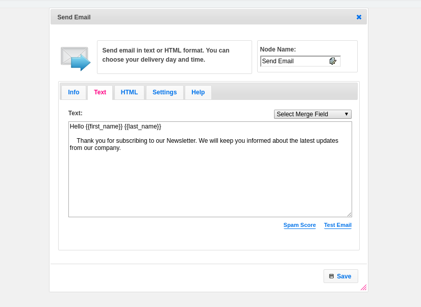
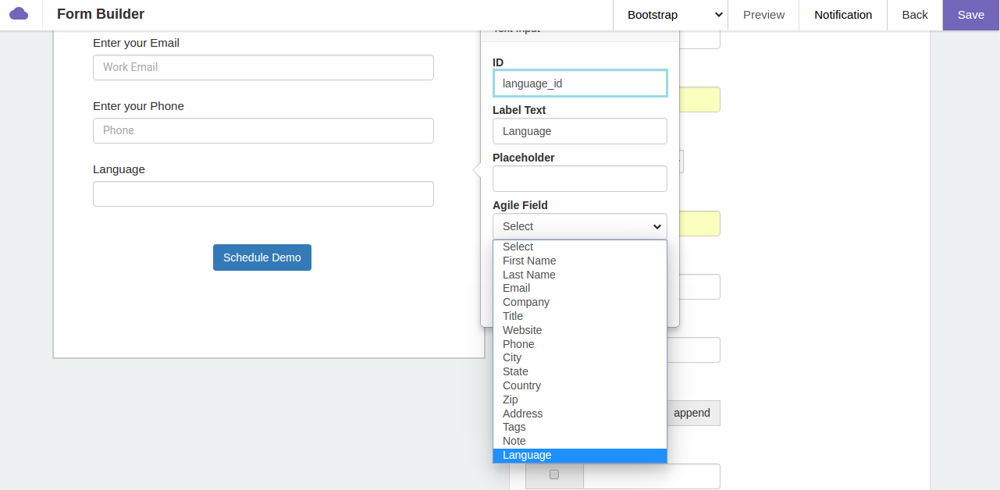
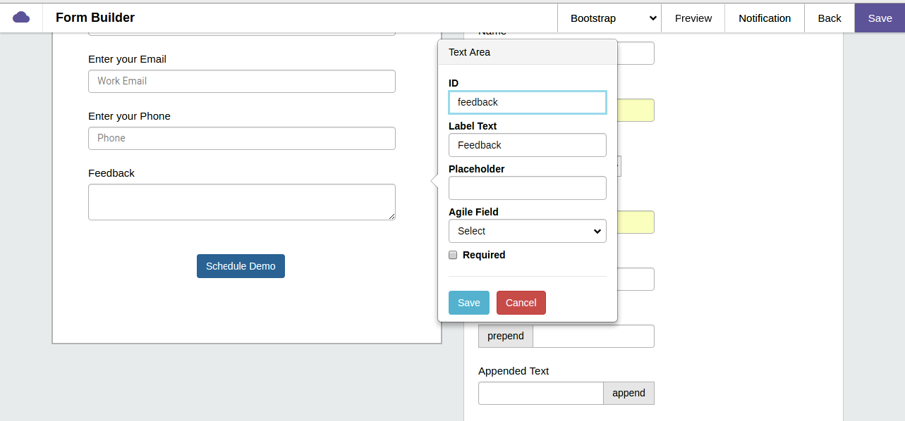

# **Merge Field Functionality**

### **What are Merge Fields?**

Merge Fields incorporates values from a record. The record can be a contact, deal, calendar etc. It can be used in multiple places like Email Templates, campaign nodes. For example, you can place a merge field in a Email Template to include the recipient name. This makes the Email personal to the recipient.

    Ex:- Dear {{first_name}} {{last_name}}



In above screenshot “first_name” , “ last_name" Merge Fields are used for sending an email with greeting. When the mail is sent , the recipient’s first name and last name are retrieved and inserted in place of the merge field.

### **Syntax of Merge Fields:**

 {{field name}} or {{{field name}}}

If merge field data contain any special character or escape sequence then use three curly braces else use two curly braces syntax. **Merge field name are case sensitive (first_name not equal to First_name).** We can also use merge fields for custom fields created by user. Merge Field feature provide special operation on some field,  for example they provide manipulated data for first name, last name, etc. Merge Fields work across different entities like Contacts, Deals,Calendar etc.

## **Detailed list of Entities and Properties:**
The detailed list of entities and the properties along with the description and example are mentioned below.
### **1.  Contacts**

| <center> <span style="font-size:16px;">Merge Fields      |  <center> <span style="font-size:16px;">Description             |    <center> <span style="font-size:16px;">Example </span>          |
|:------------------|:-------------------------|:---------------------|
|{{first_name}}    |It returns first name of contact person.| michel → michel<br>Michel→ Michel <br>A B dev→ A B dev|
|{{last_name}}|It returns last name of contact person.| clark → clark<br>WarNer→ WarNer<br>James Bond→ James bond |
|{{first_name_fix}}|This merge field converts first letter of the first name in uppercase. If first name having two words separated by space then it returns only first word.|michel → Michel <br>micHEl→ MicHEl<br>david Warner → David|
|{{last_name_fix}}|This merge field converts first letter of last name in uppercase. If last name having two words separated by space then it returns only first word.|clark → Clark<br>WarNer→ WarNer<br>James Bond→ James|
|{{name_fix}}|This merge field concat first word of first name and first word of last name separated by space  and converts both name first letter in uppercase and remaining letter will be as it is.|david warner- David Warner<br>dAvid wArner- DAvid WArner<br>If first name=”abraham Benjamin”last name=”de villiers” then output is : “Abraham De”|
|{{score}}|It returns integer value of score.| |
|{{email}}|This merge field returns latest email id of contact person.|michel_clark@gmail.com|
|{{email_work}}|This merge field returns work email id of contact person.| |
|{{email_home}}|This merge field returns personal email id of contact person.|  |
|{{company}}| This merge field returns Company name.| Agile CRM|
|{{title}}|This merge field returns job description or title.|Software Developer<br>Project Manager|
|{{website}}|This merge field returns latest updated website address|https://www.agilecrm.com|
|{{phone}}|This merge field returns latest updated phone number.| |
|{{phone_work}}|This merge field returns work phone number. | |
|{{phone_home}}|This merge field returns personal contact number.| |
|{{phone_other}}|This merge field returns other field phone number.| |
|{{phone_mobile}}|This merge field returns mobile  number.| |
|{{phone_main}}|This merge field returns main contact number.| |
|{{phone_home_fax}}|This merge field returns home fax number.| |
|{{phone_work_fax}}|This merge field returns work fax number.| |
|{{location.city}}|This merge field returns City name from contact address.|Sunnyvale|
|{{location.state}}|This merge field returns State name from contact address.|California|
|{{location.country}}|This merge field returns Country name from contact address in coded form.|e.g. India- IN<br>United State-US|
|{{location.zip}}|This merge field returns ZIP code or postal code from address.|500000|
|{{twitter_id}}|This merge field returns twitter id.| [@agilecrm](https://twitter.com/@agilecrm)|
|{{linkedin_id}}|This merge field returns Linkedin profile id as it is which is saved by the owner.| |
|{{owner.name}}|This merge field returns owner name .| Agile CRM|
|{{owner.email}}|This merge field returns owner email id.|care@agilecrm.com|
|{{owner.calendar_url}}|This merge field returns owner calender url address| |
|{{{owner.signature}}}|This merge field returns signature of owner in text format. | |
|{{{unsubscribe_link}}}|This merge field returns a link to  unsubscribe by clicking on which user can unsubscribe for the services.|https://michel.agilecrm.com/unsubscribe?sid=5709436928655360|
|{{{online_link}}}|This merge field returns online link. It’s only work for HTML not for Text Content.|
|{{{powered_by}}}|This merge field returns name of powerd by and name of powered by with link. It’s work only  for HTML.|Powered by [Agile](https://www.agilecrm.com/)|
|{{current_date}}|This merge field returns current date in the format of "dd MMM yyyy".| |
|{{current_date n}}|n is numeric value. If we want tomorrow date then use **{{current_date 1}}**.|{{current_date 1}}|
|{{current_date -n}}|n is numeric value. If we want yesterday date then use **{{current_date -1}}**.|{{current_date -1}}|
|{{custom field}}|Description is given below..| |

<span style="font-size:15px;">**{{Custom field}}-**</span>  Custom field returns the value from custom field which is created by owner. When owner creates a custom field and provide name or label of custom field along with type (Text, TextArea, Date, List, CheckBox, Number, Formula). Merge Fields work on the custom fields. Just place the Custom Field Name in the syntax and you can retrieve the custom field data. This custom field should match exactly  with the database name and it is **case sensitive.**

    For e.g. If my custom field name is “PAN” then merge field is {{PAN}}

If we have custom field type is a check box then merge field returns on or off value. And if have custom field type is a Date then merge field returns date in (`DD Mon YYYY`) format.

### **2.  Deals**

| <center> <span style="font-size:16px;">Merge Fields      |  <center> <span style="font-size:16px;">Description             |    <center> <span style="font-size:16px;">Example           |
|:-----------------------------|:------------------------------------|:---------------------|
|{{deal.name}}|This merge field returns name of the deal.|Test|
|{{deal.owner.name}}|This merge field returns name of the deal owner.|john|
|{{deal.owner.email}}|This merge field returns email id of the deal owner.|john@agilecrm.com|
|{{deal.close_date}}|This merge field returns closing date of deal in (`MM/DD/YYYY`) format.|11/23/2016|
|{{deal.created_time}}|This merge field returns created date of deal in (`MM/DD/YYYY`) format.|11/23/2015|
|{{deal.milestone}}|This merge field returns Milestone of deal.|New/Won/Lost|
|{{deal.description}}|This merge field returns Description of the deal.| |
|{{deal.expected_value}}|This merge field returns Value of deal.| |
|{{deal.expected_value_exact}}|This merge field returns Value of deal including decimal point.| |
|{{deal.probability}}|This merge field returns probability of deal.|Integer value range between 0 to 100|
|{{deal.old_milestone}}|This merge field returns name of old milestone. If deal milestone will be changed.|New/Won/Lost|
|{{deal.milestone_changed_time_string}}|This merge field returns in which date and time milestone changed.|12 Dec, 10:15|
|{{deal.custom_data.fieldname}}|Description is Given below..|  |

<span style="font-size:15px;">**{{deal.custom_data.fieldname}}-**</span> Custom field returns the value from custom field which is created by owner. When owner creates a custom field and provide name or label of custom field along with type (Text, TextArea, Date, List, CheckBox, Number, Formula). Merge Fields work on the custom fields. Just place the Custom Field Name in the syntax and you can retrieve the custom field data. This custom field should match exactly  with the database name and it is case sensitive.
<br>    For e.g. If my custom field name is **“currency”** then merge field is

    {{deal.custom_data.currency}}

If we have custom field type is a check box then merge field returns on or off value. And if have custom field type is a Date then merge field returns date in (`DD Mon YYYY`) format.

### **3.  Calendar Event**

| <center> <span style="font-size:16px;">Merge Fields      |  <center> <span style="font-size:16px;">Description             |    <center> <span style="font-size:16px;">Example           |
|:-----------------------------|:------------------------------------|:---------------------|
|{{event.title}}|This merge field returns name of the Event.|Happy New Year|
|{{event.allDay}}|This merge field returns true or false value. If event will be full day then it returns true otherwise it returns false.|`true`/`false`|
|{{event.description}}|This merge field returns description of the event.| |
|{{event.owner.name}}|This merge field returns name of the event owner.| |
|{{event.owner.email}}|This merge field returns email id of the event owner. || |

## **Detailed list of Trigger Event and Properties:**
The detailed list of Trigger Events and the properties along with the description and example are mentioned below.

### **1 . New Email Trigger**

| <center> <span style="font-size:16px;">Merge Fields      |  <center> <span style="font-size:16px;">Description  |
|:---------------------------------|:------------------------------------|
|{{message.raw_msg}}| This merge field returns the full content of the received message, including headers and content.|
|{{message.headers}}|This merge field returns an array of the headers received for the message, such as ‘Dkim-Signature’, ‘Mime-version’, ‘Date’, ‘Message-Id’, etc.|
|{{message.text}}|This merge field returns the text of the email message.|
|{{message.html}}|This merge field returns the HTML code of the message.|
|{{message.from_email}}|This merge field returns email address of the sender.|
|{{message.from_name}}|This merge field returns name of the email sender.|
|{{message.to}}|This merge field returns the email address of recipients of the message, and their name.|
|{{message.email}}|This merge field returns the forwarded email address where Agile CRM received the message.|
|{{message.subject}}|This merge field returns the subject of the message.|
|{{message.tags}}|This merge field returns the tags applied in message.|
|{{message.sender}}| ||


### **2 . Form Submit Trigger**

| <center> <span style="font-size:16px;">Merge Fields      |  <center> <span style="font-size:16px;">Description  |
|:---------------------------------|:------------------------------------|
|{{form.first_name}}|This merge field returns first name of contact person.|
|{{form.last_name}}|This merge field returns last name of contact person.|
|{{form.email}}|This merge field returns email id of contact person.|
|{{form.company}}|This merge field returns Company name.|
|{{form.title}}|This merge field returns job description or title.|
|{{form.website}}|This merge field returns website address.|
|{{form.phone}}|This merge field returns phone number.|
|{{form.city}}|This merge field returns City name from contact address.|
|{{form.state}}|This merge field returns State name from contact address.|
|{{form.country}}|This merge field returns Country name from contact address.|
|{{form.zip}}|This merge field returns ZIP code or postal code from address.|
|{{form.address}}|This merge field returns address of contact person.|
|{{form.tags}}|This merge field returns tags which is added in form.|
|{{form.note}}|This merge field returns notes about the contact which is added in form.|
|{{form.custom field}}|This merge field returns value same as Contact's custom field. ||

Also Form merge fields have two cases:<br>
* If form name is mapped with Agile Field, then use agile field. For example if form id is mapped with Agile field 'First Name' then merge field is {{form.first_name}}.



In above screenshot If custom field name is **Language** then merge field is **{{form.Language}}**.

* If form name is not mapped with Agile Field, then use given ID name. For example {{form.non_agile_field}}



In above screenshot as field id is **feedback** then we can use **{{form.feedback}}** as merge field.

### **2 . Ticket Event**

| <center> <span style="font-size:16px;">Merge Fields      |  <center> <span style="font-size:16px;">Description             |    <center> <span style="font-size:16px;">Example           |
|:-----------------------------|:------------------------------------|:---------------------|
|{{ticket.id}}|This merge field returns Ticket id.||
|{{ticket.subject}}|This merge field returns the subject of Ticket.||
|{{ticket.status}}|This merge field returns the status of the Ticket.|New, Open, Pending, Closed|
|{{ticket.requester_name}}|This merge field returns the Ticket requester name.||
|{{ticket.requester_email}}|This merge field returns the Ticket requester email.||
|{{ticket.group.id}}|This merge field returns Ticket group id.||
|{{ticket.group.group_name}}|This merge field returns Ticket group name.||
|{{ticket.assignee.name}}|This merge field returns Ticket assignee name.||
|{{ticket.assignee.email}}|This merge field returns Ticket assignee email.||
|{{ticket.priority}}|This merge field returns priority of the Ticket.|Low, Medium, High|
|{{ticket.type}}|This merge field returns type of the Ticket.|Problem, Question|
|{{ticket.source}}|This merge field returns Ticket source.|Email, Webform|
|{{ticket.created_by}}|This merge field returns who created the Ticket.|Customer|
|{{ticket.createdOn}}|This merge field returns the date when Ticket has been created.|Fri May 19, 2017|
|{{ticket.closedOn}}|This merge field returns the date when Ticket has been closed.|Fri May 19, 2017|
|{{ticket.lastUpdatedOn}}|This merge field returns the date when Ticket has been updated at last time.| Fri May 19, 2017|
|{{ticket.last_reply_text}}|This merge field returns the last response text on the Ticket.||
|{{ticket.first_notes_text}}|This merge field returns the note that is created at the time of Ticket creation.||
|{{ticket.no_of_reopens}}|This merge field returns how many times Ticket has been open.|||

### **4. Shopify Customer Created and Updated Event**

| <center> <span style="font-size:15px;">Merge Fields      |  <center> <span style="font-size:15px;">Description  |
|:---------------------------------|:------------------------------------|
|{{shopify.id}}|It returns Customer id, which is generated by Shopify for unique identification of the customer.|
|{{shopify.first_name}}|It returns first name of the customer.|
|{{shopify.last_name}}|It returns last name of the customer.|
|{{shopify.email}}|It returns primary email address of the customer.|
|{{shopify.phone}}|It returns primary phone number of the customer.|
|{{shopify.verified_email}}|It returns verified email address of the customer which is verified by Shopify.|
|{{shopify.created_at}}|It returns in which date and time customer created account on Shopify in the format of  ("2015-11-26T15:00:03-05:00")
|{{shopify.updated_at}}|It returns in which date and time customer update their account on Shopify in the format of  ("2015-11-26T15:00:03-05:00")|
|{{shopify.note}}|I returns notes about the customer in text format.|
|{{shopify.last_order_id}}|It returns last order id of the order detail, ordered by customer.|
|{{shopify.tags}}|It returns tags which is added in customer detail .Tags are additional short descriptors formatted as a string of comma-separated values. For example, if an article has three tags: tag1, tag2, tag3|
|{{shopify.orders_count}}|It returns total number of order of the customer.|
|{{shopify.accepts_marketing}}|It returns whether the customer has consented to be sent marketing material via email or not in the form of `true` or `false`.
|{{shopify.total_spent}}|It returns total amount which is spent by customer to buy a product on Shopify.
|{{shopify.state}}|It returns the state of the customer. The  customer is disabled or enabled.|
|{{shopify.default_address.id}}|It returns an unique numeric identifier for the address of the customer.|
|{{shopify.default_address.name}}|It returns full name of customer. This merge field concatenate the first name of the customer and last name of the customer separated by space.|
|{{shopify.default_address.company}}|It returns name of the company of the customer.|
|{{shopify.default_address.address1}}|It returns the customer mailing address.
|{{shopify.default_address.address2}}|It returns the value of an additional field for customer mailing address.
|{{shopify.default_address.city}}|It returns city name of the customer.
|{{shopify.default_address.province}}|It returns province or state name of the customer.|
|{{shopify.default_address.province_code}}|It returns two letter code of province or state of the customer.|
|{{shopify.default_address.country}}|It returns country name of the customer.|
|{{shopify.default_address.country_code}}|It returns country code of the customer.|
|{{shopify.default_address.zip}}|It returns the zip code or postal code of the customer.|
|{{shopify.default_address.phone}}|It returns the phone number of the customer.|
|{{shopify.addresses}}|It returns all the addresses of the customer and we can iterate the addresses.|

In customer details if we want to access all addresses of the customer then we have to iterate one by one. In address all field are same as default address. all customer merge field are case sensitive.
In Shopify Customer merge field We can also retrieve data from custom fields which is added by customer.

e.g.- If custom field name is **“mobile”** then we have to write

    {{shopify.customer.mobile}}.

**Note:-** For more details visit  https://docs.shopify.com/api/customer


### **5. Shopify Order Event**

| <center> <span style="font-size:15px;">Merge Fields      |  <center> <span style="font-size:15px;">Description  |
|:---------------------------------|:------------------------------------|
|{{shopify.id}}|It returns the unique numeric identifier for the order. This one is used for API purposes. This is different from the order_number property.|
|{{shopify.order_number}}|It returns a unique numeric identifier for the order. This one is used by the shop owner and customer.|
|{{shopify.name}}|It returns the customer's order name as represented by a number.|
|{{shopify.note}}|it returns the text of an optional note that a shop owner can attach to the order.|
|{{shopify.email}}|It returns customer email address if the billing address is present.|
|{{shopify.currency}}|It returns the three letter code  [ISO 4217 format](https://en.wikipedia.org/wiki/ISO_4217) for the currency used for the payment (e.g. USD, INR).
|{{shopify.discount_codes}}|It returns applicable discount codes that can be applied to the order. If no codes exist the value will default to blank.|
|{{shopify.total_discounts}}|It returns the total amount of the discounts to be applied to the price of the order.|
|{{shopify.subtotal_price}}|It returns the Price of the order before shipping and taxes.|
|{{shopify.taxes_included}}|It returns the states whether or not taxes are included in the order subtotal. Valid values are `true` or `false`.|
|{{shopify.tax_lines}}|It returns details of the tax.|
|{{shopify.total_price}}|It returns the sum of all the prices of all the items in the order, taxes and discounts included.|
|{{shopify.total_tax}}|It returns the sum of all the taxes applied to the order (must be positive).|
|{{shopify.total_weight}}|It returns the sum of all the weights of the line items in the order, in grams.|
|{{shopify.browser_ip}}|It returns the IP address of the browser used by the customer when placing the order.|
|{{shopify.buyer_accepts_marketing}}|It returns the status of the person who placed the order would like to receive email updates from the shop in the form of `true` or `false`.|
|{{shopify.cancel_reason}}|It returns the reason why the order was cancelled. If the order was not cancelled, this value is "null." If the order was cancelled.|
|{{shopify.cancelled_at}}|It returns the date and time when the order was cancelled. If the order was cancelled, the API returns this value in [ISO 8601 format](https://en.wikipedia.org/wiki/ISO_8601). If the order was not cancelled, this value is "null."|
|{{shopify.cart_token}}|It returns the unique identifier for a particular cart that is attached to a particular order.|
|{{shopify.closed_at}}|It returns the date and time when the order was closed. If the order was closed, the API returns this value in  [ISO 8601 format](https://en.wikipedia.org/wiki/ISO_8601). If the order was not closed, this value is null.|
|{{shopify.created_at}}|It returns the date and time when the order was created in Shopify, in  [ISO 8601 format](https://en.wikipedia.org/wiki/ISO_8601).|
|{{shopify.tags}}|It returns the order tag detail. Tags are additional short descriptors, commonly used for filtering and searching, formatted as a string of comma-separated values. For example, if an order has three tags: tag1, tag2, tag3. Each individual tag is limited to 40 characters in length.|
|{{shopify.billing_address.name}}|It returns full name of customer. This merge field concat the first name of the customer and last name of the customer separated by space.|
|{{shopify.billing_address.company}}|It returns name of the company of the customer.|
|{{shopify.billing_address.address1}}|It returns the customer mailing address.|
|{{shopify.billing_address.address2}}|It returns the value of an additional field for customer billing address.|
|{{shopify.billing_address.city}}|It returns city name of the customer.|
|{{shopify.billing_address.province}}|It returns province or state name of the customer.|
|{{shopify.billing_address.province_code}}|It returns two letter code of province or state of the customer.|
|{{shopify.billing_address.country}}|It returns country name of the customer.|
|{{shopify.billing_address.country_code}}|It returns country code of the customer.|
|{{shopify.billing_address.zip}}|It returns the zip code or postal code of the customer.|
|{{shopify.billing_address.phone}}|It returns the phone number of the customer.|
|{{shopify.shipping_address.name}}|It returns full name of customer. This merge field concat the first name of the customer and last name of the customer separated by space.|
|{{shopify.shipping_address.company}}|It returns name of the company of the customer.|
|{{shopify.shipping_address.address1}}|It returns the customer mailing address.|
|{{shopify.shipping_address.address2}}|It returns the value of an additional field for customer billing address.|
|{{shopify.shipping_address.city}}|It returns city name of the customer.|
|{{shopify.shipping_address.province}}|It returns province or state name of the customer.|
|{{shopify.shipping_address.province_code}}|It returns two letter code of province or state of the customer.|
|{{shopify.shipping_address.country}}|It returns country name of the customer.|
|{{shopify.shipping_address.country_code}}|It returns country code of the customer.|
|{{shopify.shipping_address.zip}}|It returns the zip code or postal code of the customer.|
|{{shopify.shipping_address.phone}}|It returns the phone number of the customer.|
|{{shopify.shipping_address.latitude}}|It returns latitude value of shipping address.|
|{{shopify.shipping_address.longitude}}|It returns longitude value of shipping address.|
|{{shopify.line_items}}|It returns the all line items, we can iterate one by one.|
|{{shopify.fulfillments}}|It returns the details of fulfillments.|
|{{shopify.customer.id}}|It returns Customer id, which is generated by Shopify for unique identification of the customer.|
|{{shopify.customer.first_name}}|It returns first name of the customer.|
|{{shopify.customer.last_name}}|It returns last name of the customer.
|{{shopify.customer.email}}|It returns primary email address of the customer.|
|{{shopify.customer.created_at}}|It returns in which date and time customer created account on Shopify in the format of  ("2015-11-26T15:00:03-05:00")|
|{{shopify.customer.updated_at}}|It returns in which date and time customer update their account on Shopify in the format of  ("2015-11-26T15:00:03-05:00")|
|{{shopify.customer.note}}|It returns notes about the customer in text format.|
|{{shopify.customer.tags}}|It returns tags which is added in customer detail .Tags are additional short descriptors formatted as a string of comma-separated values. For example, if an article has three tags: tag1, tag2, tag3|
|{{shopify.customer.orders_count}}|It returns total number of order of the customer.|
|{{shopify.customer.accepts_marketing}}|It returns whether the customer has consented to be sent marketing material via email or not in the form of `true` or `false`.|
|{{shopify.customer.total_spent}}|It returns total amount which is spent by customer to buy a product on Shopify.|
|{{shopify.customer.state}}|It returns the state of the customer. The  customer is disabled or enabled.|
|{{shopify.gateway}}|It returns the name of the payment gateway used for the payment.|
|{{shopify.landing_site}}|It returns the URL address for the page where the buyer landed when entering the shop.|
|{{shopify.source_name}}|It returns the Where the checkout originated. Possible values are: "web", "pos", "iphone", and "android".|
|{{shopify.referring_site}}|It returns the website url address that the customer clicked on to come to the shop.|
**Note:-** For more details visit  https://docs.shopify.com/api/order

### **6. Shopify Checkout**

| <center> <span style="font-size:15px;">Merge Fields      |  <center> <span style="font-size:15px;">Description  |
|:---------------------------------|:------------------------------------|
|{{shopify.id}}|It returns the unique numeric identifier for the order. This one is used for API purposes.|
|{{shopify.note}}|It returns the text of an optional note that a shop owner can attach to the order.|
|{{shopify.email}}|It returns customer email address if the billing address is present.|
|{{shopify.currency}}|It returns the three letter code  [ISO 4217 format](https://en.wikipedia.org/wiki/ISO_4217) for the currency used for the payment (e.g. USD, INR).|
|{{shopify.discount_codes}}|It returns applicable discount codes that can be applied to the order. If no codes exist the value will default to blank.|
|{{shopify.total_discounts}}|It returns the total amount of the discounts to be applied to the price of the order.|
|{{shopify.subtotal_price}}|It returns the Price of the order before shipping and taxes.|
|{{shopify.tax_lines}}|It returns the details of the tax.|
|{{shopify.total_price}}|It returns the sum of all the prices of all the items in the order, taxes and discounts included.|
|{{shopify.total_line_items_price}}|It returns the sum of all items price in the order.|
|{{shopify.total_tax}}|It returns the sum of all the taxes applied to the order (must be positive).|
|{{shopify.total_weight}}|It returns the sum of all the weights of the line items in the order, in grams.|
|{{shopify.token}}|It returns unique identifier for particular order.|
|{{shopify.taxes_included}}|It returns the states whether or not taxes are included in the order subtotal. Valid values are `true` or `false`.|
|{{shopify.buyer_accepts_marketing}}|It returns the status of the person who placed the order would like to receive email updates from the shop in the form of `true` or `false`.|
|{{shopify.cart_token}}|It returns the unique identifier for a particular cart that is attached to a particular order.|
|{{shopify.closed_at}}|It returns the date and time when the order was closed. If the order was closed, the API returns this value in [ISO 8601 format](https://en.wikipedia.org/wiki/ISO_8601). If the order was not closed, this value is null.|
|{{shopify.created_at}}|It returns the date and time when the order was created in Shopify, in  [ISO 8601 format](https://en.wikipedia.org/wiki/ISO_8601).|
|{{shopify.gateway}}|It returns the name of the payment gateway used for the payment.|
|{{shopify.landing_site}}|It returns the URL address for the page where the buyer landed when entering the shop.|
|{{shopify.source_name}}|It returns the Where the checkout originated. Possible values are: "web", "pos", "iphone", and "android".|
|{{shopify.abandoned_checkout_url}}|It returns the full recovery URL to be sent to a customer to recover their abandoned checkout.|
|{{shopify.referring_site}}|It returns the website url address that the customer clicked on to come to the shop.|
|{{shopify.billing_address.name}}|It returns full name of customer. This merge field concat the first name of the customer and last name of the customer separated by space.|
|{{shopify.billing_address.company}}|It returns name of the company of the customer.|
|{{shopify.billing_address.address1}}|It returns the customer mailing address.|
|{{shopify.billing_address.address2}}|It returns the value of an additional field for customer billing address.|
|{{shopify.billing_address.city}}|It returns city name of the customer.
|{{shopify.billing_address.province}}|It returns province or state name of the customer.|
|{{shopify.billing_address.province_code}}|It returns two letter code of province or state of the customer.|
|{{shopify.billing_address.country}}|It returns country name of the customer.|
|{{shopify.billing_address.country_code}}|It returns country code of the customer.|
|{{shopify.billing_address.zip}}|It returns the zip code or postal code of the customer.|
|{{shopify.billing_address.phone}}|It returns the phone number of the customer.|
|{{shopify.shipping_address.name}}|It returns full name of customer. This merge field concat the first name of the customer and last name of the customer separated by space.|
|{{shopify.shipping_address.company}}|It returns name of the company of the customer.|
|{{shopify.shipping_address.address1}}|It returns the customer mailing address.|
|{{shopify.shipping_address.address2}}|It returns the value of an additional field for customer billing address.|
|{{shopify.shipping_address.city}}|It returns city name of the customer.|
|{{shopify.shipping_address.province}}|It returns province or state name of the customer.|
|{{shopify.shipping_address.province_code}}|It returns two letter code of province or state of the customer.|
|{{shopify.shipping_address.country}}|It returns country name of the customer.|
|{{shopify.shipping_address.country_code}}|It returns country code of the customer.|
|{{shopify.shipping_address.zip}}|It returns the zip code or postal code of the customer.|
|{{shopify.shipping_address.phone}}|It returns the phone number of the customer.|
|{{shopify.shipping_address.latitude}}|It returns latitude value of shipping address.|
|{{shopify.shipping_address.longitude}}|It returns longitude value of shipping address.|
|{{shopify.line_items}}|It returns all line items, we can iterate one by one.|
|{{shopify.customer.id}}|It returns Customer id, which is generated by Shopify for unique identification of the customer.|
|{{shopify.customer.first_name}}|It returns first name of the customer.|
|{{shopify.customer.last_name}}|It returns last name of the customer.|
|{{shopify.customer.email}}|It returns primary email address of the customer.|
|{{shopify.customer.created_at}}|It returns in which date and time customer created account on Shopify in the format of  ("2015-11-26T15:00:03-05:00").|
|{{shopify.customer.updated_at}}|It returns in which date and time customer update their account on Shopify in the format of  ("2015-11-26T15:00:03-05:00")|
|{{shopify.customer.note}}|It returns notes about the customer in text format.|
|{{shopify.customer.tags}}|It returns tags which is added in customer detail .Tags are additional short descriptors formatted as a string of comma-separated values. For example, if an article has three tags: tag1, tag2, tag3|
|{{shopify.customer.orders_count}}|It returns total number of order of the customer.|
|{{shopify.customer.accepts_marketing}}|It returns whether the customer has consented to be sent marketing material via email or not in the form of `true` or `false`.|
|{{shopify.customer.total_spent}}|It returns total amount which is spent by customer to buy a product on Shopify.|
|{{shopify.customer.state}}|It returns the state of the customer. The  customer is disabled or enabled.|


**Note:-** For more details visit  https://docs.shopify.com/api/checkout

### **7. Common Merge Fields for all Stripe Events**

| <center> <span style="font-size:15px;">Merge Fields      |  <center> <span style="font-size:15px;">Description  |
|:---------------------------------|:------------------------------------|
|{{stripe.id}}|It returns the unique  id in string format provided by Stripe.|
|{{stripe.object}}||
|{{stripe.created}}|It returns date and time of account creation of the customer in Timestamp format.|
|{{stripe.currency}}|It returns the three letter code (ISO 4217) for the currency used for the payment (e.g. USD, INR).|
|{{stripe.description}}|It returns small description about customer in text.|
|{{stripe.livemode}}|It returns boolean value `true` or `false`.|
|{{stripe.metadata}}|It returns a set of key/value pairs that is attached in a customer object. It can be useful for retrieving additional information about the customer in a structured format.|
|{{stripe.shipping}}|It returns shipping information related to customer.|
|{{stripe.sources.id}}|It returns an unique numeric identifier for the address of the customer.|
|{{stripe.sources.name}}|It returns full name of customer. This merge field concat the first name of the customer and last name of the customer separated by space.|
|{{stripe.sources.line1}}|It returns mailing address of the customer.|
|{{stripe.sources.line1_check}}|It returns results of the check: pass, fail, unavailable, or unchecked. If address_line1 was provided.|
|{{stripe.sources.line2}}|It returns the value of an additional field for customer mailing address.|
|{{stripe.sources.address_city}}|It returns city name of the customer.|
|{{stripe.sources.address_state}}|It returns province or state name of the customer.|
|{{stripe.sources.address_country}}|It returns two letter country code(e.g. IN, US) of the customer.|
|{{stripe.sources.address_zip}}|It returns the zip code or postal code of the customer.|
|{{stripe.sources.address_zip_check}}|It returns results of the check: pass, fail, unavailable, or unchecked. If address_zip was provided.|
|{{stripe.sources.brand}}|It returns the name of the credit card provider company.|
|{{stripe.sources.customer}}|It returns the customer that this card belongs to. This attribute will not be in the card object if the card belongs to an account or recipient instead.|
|{{stripe.sources.cvc_check}}|It returns status of cvc checked status(e.g. `pass`, `fail`).|
|{{stripe.sources.dynamic_last4}}|It returns the last four digits of the device account number.|
|{{stripe.sources.exp_month}}|It returns numeric value for month,in which month credit card expire.|
|{{stripe.sources.exp_year}}|It returns year of expiry of the credit card.|
|{{stripe.sources.funding}}|It returns the Card funding type. Can be credit, debit, prepaid, or unknown.|
|{{stripe.sources.last4}}|It returns the last for digit of credit card card number.|
|{{stripe.sources.metadata}}|It returns a set of key/value pairs that is attached in a customer object. It can be useful for retrieving additional information about the customer in a structured format.|
|{{stripe.sources.name}}|It returns name of the card holder.|
|{{stripe.sources.tokenization_method}}|It returns If the card number is tokenized, this is the method that was used. Can be apple_pay or android_pay.|

### **8. Stripe Customer Deleted Event**

| <center> <span style="font-size:15px;">Merge Fields      |  <center> <span style="font-size:15px;">Description  |
|:---------------------------------|:------------------------------------|
|{{stripe.account_balance}}|It returns current stripe account balance of customer.|
|{{stripe.default_source}}|It returns the ID of the default source attached to this customer.|
|{{stripe.delinquent}}|It returns boolean value `true` or `false` for Whether or not the latest charge for the customer’s latest invoice has failed.|
|{{stripe.discount}}|It returns the description about current discount active on the customer, if there is one.|
|{{stripe.email}}|It returns the email id of the customer.|
|{{stripe.shipping}}|It returns shipping information related to customer and charge.|
|{{stripe.has_more}}|It returns boolean value for more elements available after this set. If false, this set comprises the end of the list.|
|{{stripe.total_count}}|It returns the total number of items available.|
|{{stripe.url}}|It returns the URL where this list can be accessed.|
|{{stripe.subscriptions}}|It returns the list of the customer’s current subscriptions.|
|{{stripe.sources.has_more}}| |
|{{stripe.sources.total_count}}| |
|{{stripe.sources.url}}|| |

### **9. Common Merge Fields for all Charge Event of Stripe**

| <center> <span style="font-size:15px;">Merge Fields      |  <center> <span style="font-size:15px;">Description  |
|:---------------------------------|:------------------------------------|
|{{stripe.amount}}|It returns amount.|
|{{stripe.amount_refunded}}|It returns total refunded amount.|
|{{stripe.application_fee}}|It returns fee of application.|
|{{stripe.balance_transaction}}|It returns balance transaction that describes the impact on your account balance.|
|{{stripe.destination}}|It returns ID of the bank account, card, or Stripe account the transfer was sent to.|
|{{stripe.dispute}}|It returns the details about the dispute if the charge has been disputed.|
|{{stripe.failure_code}}|It returns error code explaining reason for charge failure.|
|{{stripe.failure_message}}|It returns the reason for the refund. If set, possible values are `duplicate`, `fraudulent`, and `requested_by_customer`.|
|{{stripe.fraud_details}}|It returns Hash with information on fraud assessments for the charge. Assessments reported by you have the key user_reportand, if set, possible values ofsafe and fraudulent. Assessments from Stripe have the key stripe_report and, if set, the value fraudulent.|
|{{stripe.invoice}}|It returns ID of the invoice this charge is for if one exists.|
|{{stripe.subscriptions}}|It returns the list of the customer’s current subscriptions.|
|{{stripe.paid}}|It returns true if the charge succeeded, or was successfully authorized for later capture, otherwise returns false.|
|{{stripe.receipt_email}}|It returns email id of recipient.|
|{{stripe.receipt_number}}|It returns the transaction number that appears on email receipts sent for this refund.|
|{{stripe.refunded}}|It returns boolean value, Whether or not the fee has been fully refunded. If the fee is only partially refunded, this attribute will still be false.|
|{{stripe.refunds.object}}|It returns list.|
|{{stripe.refunds.data}} (Type: Array)||
|{{stripe.refunds.has_more}}|It returns boolean value `true` or `false`.|
|{{stripe.refunds.total_count}}|It returns the total number of items available.|
|{{stripe.refunds.url}}|It returns the URL where this list can be accessed.|
|{{stripe.statement_discriptor}}|It returns the extra information about a charge. This will appear on your customer’s credit card statement.|
|{{stripe.status}}|It returns the status of the payment is either `succeeded` or `failed`.|

**Note:-** For more details visit https://stripe.com/docs/api#

## **Mustache**

Agile supports advanced Mustache templates. You can use Mustache syntax in your email content or other places.
Refer - http://mustache.github.io/mustache.5.html for conditions or loops.

You can test your mustache template code using this tool - http://trymustache.com/


## **Mustache Array Example**

```json
{
"data":["Work","Home","Personal","Office"]}
}
```
Merge Field Syntax:-
```javascript
   {{#data}}{{.}}{{/data}}
```

### **Output:**
    Work
    Home
    Personal
    Office

**Note:-** Using above merge field syntax we can iterate the data of array.

## **Mustache Section example**
```json
{
   "first_name":"Michel",
   "last_name":""

}
```
```javascript
Syntax of Merge Fields:-

    * {{#first_name}} {{first_name}}   {{#last_name}}{{last_name}}{{/last_name}} {{/first_name}}
    * {{first_name}}
    * {{last_name}}

```
### **Output:**
      * Michel
      * Michel
      *

**Note:-** A section begins with a pound and ends with a slash. That is, {{#first_name}} begins a first_name section, while {{/first_name}} ends it. The text between the two tags is referred to as that section's "block".

The behavior of the section is determined by the value of the key.
If the first_name key does not exist, or exists and has a value of null, undefined, false, 0, or NaN, or is an empty string or an empty list, the block will not be rendered.

## **Mustache Inverted Section example**
```json
{
   "first_name":"",
   "last_name":"Clark"

}
```
```javascript
Syntax of Merge Fields:-

    {{#first_name}} {{first_name}} {{/first_name}} {{^first_name}}{{last_name}}{{/first_name}}

```
### **Output:**
        Clark

**Note:-** An inverted section opens with {{^first_name}}. The block of an inverted section is rendered only if the value of that first_name tag is null, undefined, false, false or an empty list.

## **Mustache Example for Unescaped HTML value**
```json
{
   "online_link":" <b>https://www.agilecrm.com</b>"
}
```
```javascript
Syntax of Merge Fields:-
  * {{onine_link}}
  * {{{online_link}}}
  * {{&online_link}}
```
### **Output:**
      *  &lt;b&gt;https://www.agilecrm.com&lt;/b&gt;
      *  https://www.agilecrm.com
      *  https://www.agilecrm.com

**Note:-** If you want to render unescaped HTML, use the triple mustache: {{{online_link}}}. You can also use {{&online_link}}  to unescape a variable.

## **Mustache dot notation example**
```json
{
  "owner": {
    "name": "Michael",
    "email": "michael@agilecrm.com"
  }
}
```
```javascript
Syntax of Merge Fields:-
  * {{owner.name}}
  * {{owner.email}
```
### **Output:**
    * Michael
    * michael@agilecrm.com

**Note:-** Dot notation may be used to access keys that are properties of objects in a view.
